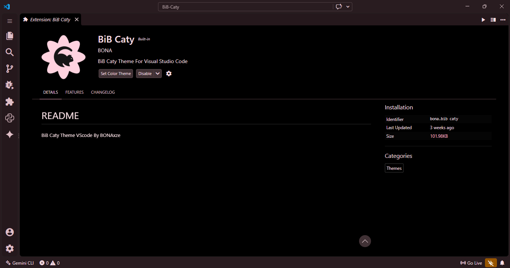
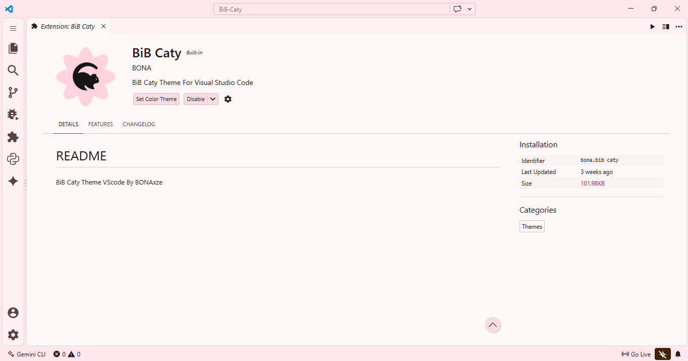

<p align="center">
  
</p>

# MD3: Content 0 Dark (Bib Caty Dark)

A sleek, modern dark theme for Visual Studio Code inspired by Material Design 3 (MD3) guidelines and vibrant expressive color palettes. Designed for high readability, soothing dark backgrounds, and distinct code syntax highlighting.

---

## Preview

### AMOLED Dark Preview


### Lighting Preview


---

## Features

* **Soothing Dark Palette:** Deep background tones (`#1c1014`) combined with vibrant accents (`#ffb1c8`, `#d33b7b`) to reduce eye strain during long coding sessions.
* **Material Design 3 Aesthetic:** Carefully tuned editor UI elements including tabs, sidebars, activity bar, and status bar.
* **Rich Syntax Highlighting:**
  * **Keywords & Control:** Soft pastel blues (`#b1c5ff`, `#88ceff`)
  * **Strings:** Vibrant mint green (`#40e26e`)
  * **Functions:** High-visibility lime/chartreuse (`#b7d300`)
  * **Types & Classes:** Refreshing turquoise (`#00dfc0`)
  * **Variables:** Vivid cyan (`#00daf2`)
  * **Numbers & Constants:** Warm peach and orange (`#ffb4a5`, `#ffb779`)
  * **Comments:** Clean muted gray (`#ababab`)
* **Semantic Highlighting Enabled:** Built-in support for modern language server token coloring.

---

## Color Palette Overview

| Element | Hex Color | Color Description |
| :--- | :--- | :--- |
| **Editor Background** | `#1c1014` | Dark Berry |
| **Activity Bar Active** | `#ffb1c8` | Soft Pink |
| **Active Tab Background** | `#d33b7b` | Deep Rose |
| **Foreground / Text** | `#f5dde2` | Rose Tint White |
| **Strings** | `#40e26e` | Mint Green |
| **Functions** | `#b7d300` | Lime Green |
| **Types & Classes** | `#00dfc0` | Turquoise |
| **Variables** | `#00daf2` | Bright Cyan |

---

## Installation

### Option 1: Via VS Code Extension Marketplace
1. Open **Visual Studio Code**.
2. Press `Ctrl+P` (or `Cmd+P` on macOS) and run:
   ```text
   ext install bib-caty-dark
   ```
3. Select **MD3:Content 0 Dark** as your color theme.

### Option 2: Manual Installation (Local Repository)
1. Copy the `themes` folder and `bib-caty-dark-color-theme.json` file into your local VS Code extensions directory:
   * **Windows:** `%USERPROFILE%\.vscode\extensions\`
   * **macOS / Linux:** `~/.vscode/extensions/`
2. Restart VS Code and activate the theme from `Preferences: Color Theme` (`Ctrl+K Ctrl+T`).

---

## License

This theme is available under the MIT License.
